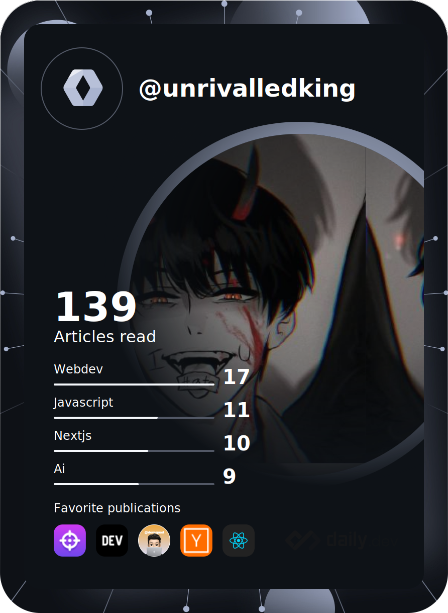
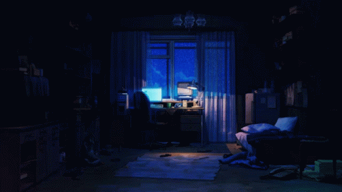

    

  

<h2 align="center">Technical Lead at GDG Patna || Software Development Lead</h2>
<h2 align="center"> Self-taught, Curious, and Passionate about Coding!</h2>

- 🌳 I’m currently learning NodeJs, Express, MongoDB & Django REST API!  
   

- 🐾 I’m looking to network and make friends here!   

- 🌊 2023 Goals: Keep Learning & Help others in any way possible so feel free to ask me anything! 😆   

- ☕ Interest: Coding, Anime, Manga, Gaming, Coffee.   

- :octocat: Hobbies: Anime, Manga, Gaming, Novel & Travelling 🧳✈🚢   

<h2></h2> 

 
   

  <h2> <strong> Actively Learning </strong></h2>
     
  <h2> <strong> Plan to Learn </strong></h2>
  

 
    

  

  <h2> <strong> My Github Stats </strong> </h2>
      

  

<!--   -->

<!--  -->

   

    
  

<!--  -->

  <h3 align="center">Connect With Me</h3>

  
  
  
  <a>

